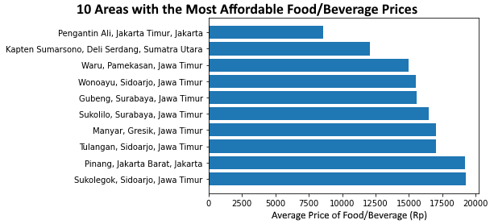
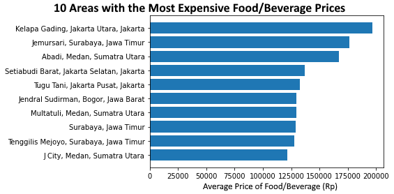
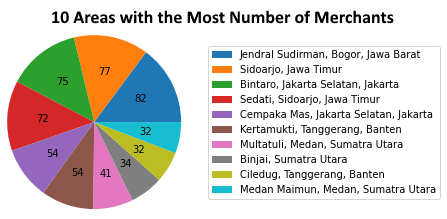
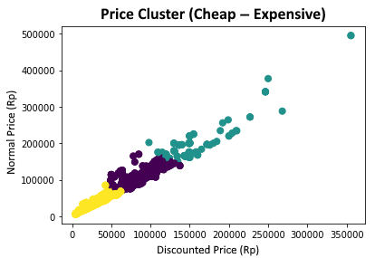
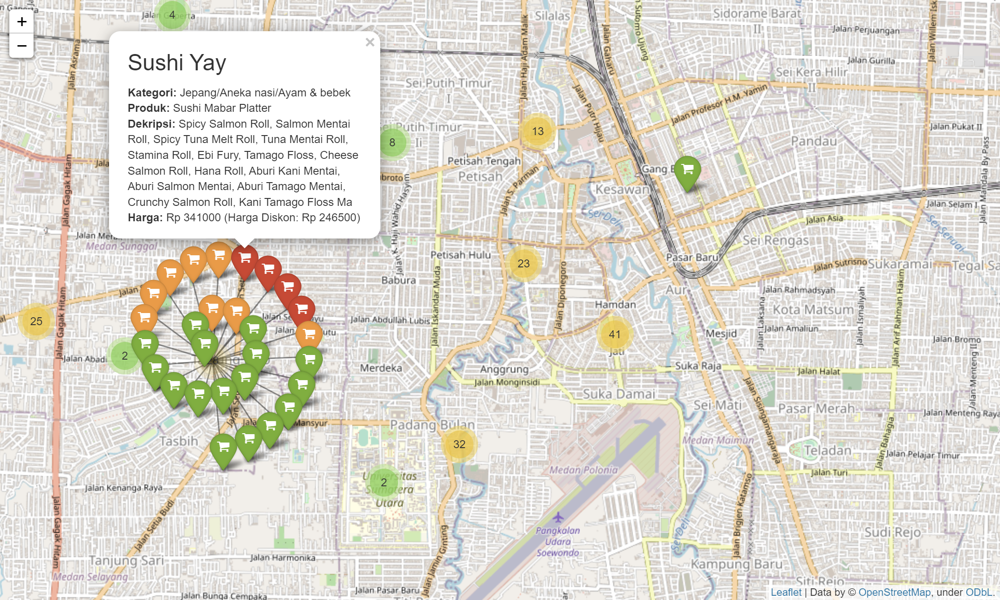

# GoFood Price Clustering
GoFood price clustering using K-means (also includes data visualization). This assignment was made as part of the course "Kapita Selekta Informatika" in 2022.

|||
|-|-|
|119140224|Andhika Putra|
|119140218|Andhika Wibawa|
|119140214|Tri Aji Bagaskara|

## Python Requirements
|Module Name|Required For|
|-|-|
|Pandas|Manipulating dataset|
|GeoPy|Getting coordinate of places|
|Matplotlib|Visualizing data|
|Sklearn|K-means clustering|
|Folium|Interactive map|

## Some Results

## Source
Dataset was taken from Reyhan Ariq Syahalam ([Kaggle link](https://www.kaggle.com/datasets/ariqsyahalam/indonesia-food-delivery-gofood-product-list)).